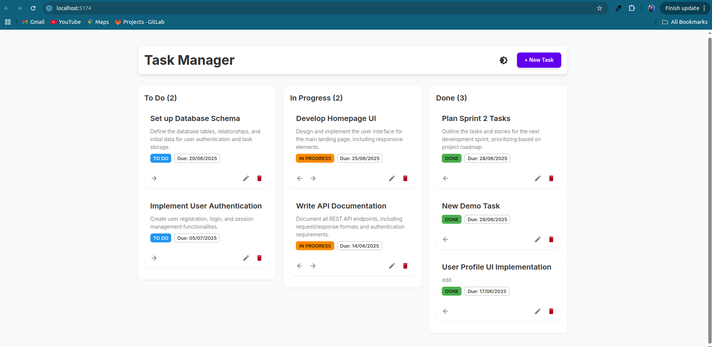
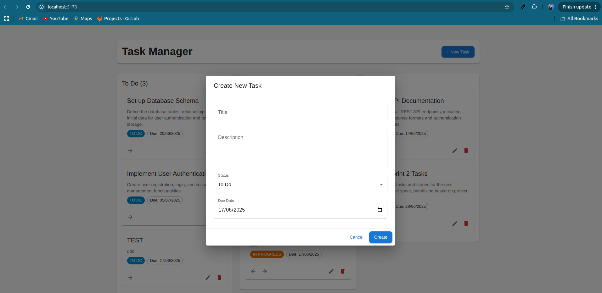

# Task Manager

A simple dashboard to organize your tasks.

## Features
- Add, edit, and delete tasks
- Move tasks between columns (To Do, In Progress, Done)
- Works on mobile and desktop
- Clean, modern design

## How to Use
1. Install: `npm install`
2. Run: `npm run dev`
3. Open: `http://localhost:5173`

## Built With
- React
- TypeScript
- Material UI
- Vite

## 📸 Preview

  

    
    
<strong>Main Dashboard</strong> - View and manage all tasks

  

  

    
    
<strong>Task Form</strong> - Add or edit tasks

  

